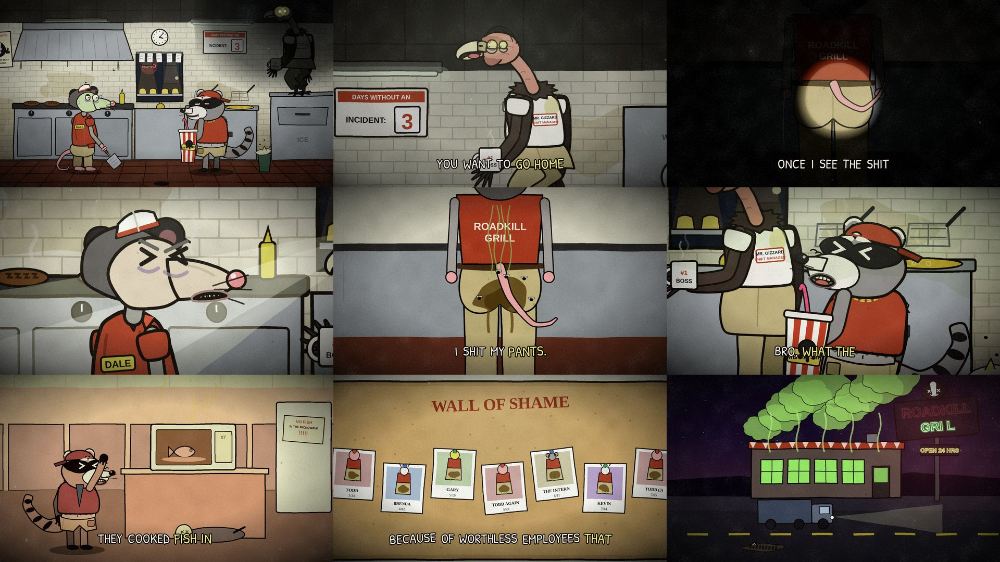

# Episode 004 — "How To Leave Early"



| | |
|---|---|
| **Audio** | Supplied by you (comedy skit audio, 1:31). No audio credit is written into the video or this repo on purpose — add it in each platform's description once you've confirmed the source. |
| **Length** | 1:33 (91.3 s audio + 1.6 s silent punchline on the exterior) |
| **Status** | ✅ final — timeline from the real audio (whisper + Rhubarb) |
| **Compositions** | `ep004-leave-early` (1920×1080) · `ep004-leave-early-vertical` (1080×1920) |
| **Code** | `video/src/episodes/004-leave-early/` — `grill.tsx` (kitchen set, cameras), `cutaways.tsx`, `shots.tsx`, `timeline.json` |

**Cast (new, shared in `video/src/characters/`):**
- **Dale** (`Possum.tsx`) — sickly possum line cook in uniform khakis, paper hat, bare pink tail. Wants to go home.
- **Chet** (`Raccoon.tsx`) — raccoon bro at the fryer: ripped-sleeve polo, backwards cap, gold chain, a bucket-sized MEGA SIP.
- **Mr. Gizzard** (`Vulture.tsx`) — vulture shift manager: comb-over, half-moon glasses, khakis hiked to the chest,
  a "#1 BOSS" mug and a headlamp for when he must bear witness. Perches on the ice machine like a gargoyle.

**Set:** the ROADKILL GRILL, a roadside joint at 3:47 AM (tread-marked patties, a skunk mascot, a DAYS WITHOUT AN
INCIDENT board that resets on cue). Cutaways: exterior neon, Chet's office fish flashback, the printer room's tower of
emergency khakis, the wall of shame. Silent beats: the eye-glow reveal (5–8 s), the strain (48.3–50.5 s), Dale
thinking about round two (83.3–86.2 s); the punchline is the whole building venting green.

**Speakers** were assigned from the script's meaning, checked against the reference video and a per-line timbre
comparison (one actor voices all three). Close calls: Chet gets *"Why do you have an extra pair of khakis?"*,
*"I didn't make you… I can't believe you"* and both closing lines; Dale gets *"You made me"* and *"Really?"*.
Edit `speakers.json` and re-run `python3 pipeline/build_timeline.py episodes/004-leave-early` if you hear it differently.

## Render (both versions)
```bash
pipeline/fetch_audio.sh <the-audio-file.mp3> episodes/004-leave-early   # -> video/public/episodes/004-leave-early/audio.wav
cd video && npm run render -- 004-leave-early
```

## Upload kit
**Title:** How To Leave Work Early (Animated) · alt: *He's Gotta See It*
**Description:** 3:47 AM at the Roadkill Grill. Dale wants to go home. Mr. Gizzard has conditions.
*(add the audio credit here)*
**Tags:** how to leave early, leave work early, animated skit, cursed animation, creepy cartoon, dark humor animation, fast food, boss
