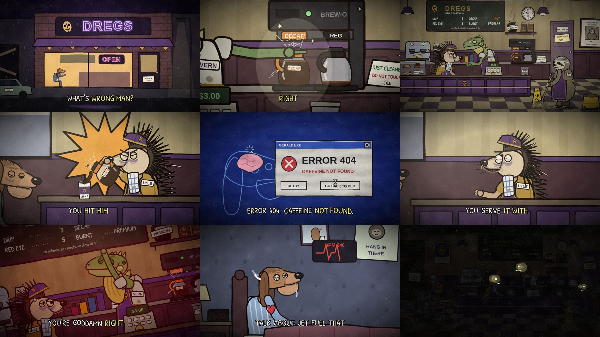

# Episode 005 — "Last Minute Orders"



| | |
|---|---|
| **Audio** | Supplied comedy skit audio (2:12). No audio credit is written into the video or this repo on purpose; add it in each platform's description once you've confirmed the source. |
| **Length** | 2:14.8 (132.2 s audio + 2.6 s silent punchline: lights out at DREGS) |
| **Status** | ✅ timeline from the real audio (whisper + Rhubarb), stills reviewed in both formats; full MP4s to be rendered centrally |
| **Compositions** | `ep005-last-orders` (1920×1080) · `ep005-last-orders-vertical` (1080×1920) |
| **Code** | `video/src/episodes/005-last-orders/` — `dregs.tsx` (shop set, cameras), `cutaways.tsx`, `shots.tsx`, `props.tsx`, `fixes.ts`, `cast/`, `timeline.json` |

**Cast (new, episode-local in `video/src/episodes/005-last-orders/cast/`):**
- **Lyle** (`Lyle.tsx`) — frazzled hedgehog barista who *already cleaned the station*. Quills that bristle on cue
  (and shed when he's stressed), a purple DREGS paper cap, a mustard tee under the purple apron, a checked bar towel,
  bloodshot beady eyes with luggage-sized bags and a twitch. Carries the carafes (orange handle = decaf).
- **Vern** (`Vern.tsx`) — iguana coworker with a plan. Permanently heavy-lidded, a hinged lizard jaw whose grin runs
  too far back, a dewlap that flares when he gets to the good part, spines down the neck, a long banded tail.
- **Mo** (`Mo.tsx`) — sloth on mop duty and the voice of reason. Algae-tinted shaggy fur, a hairnet, sloth-mask eye
  stripes, three long claws round a mop he pushes in permanent slow motion (two-bone IK keeps his hands on the handle).
  A moth lives in his fur. Everything he does is half speed, except the last line.
- **Gerald** (`Gerald.tsx`) — the customer (non-speaking): a bloodhound in a slept-in grey suit, ears to his
  shoulders, jowls to his collar. States for every stage of the scheme: groggy, headache, sick in bed (pyjamas,
  thermometer, ice pack), sleeping peacefully, and wired (spiral eyes, heart pounding out of his chest).

**Brand & set:** **DREGS** — *"coffee til the bitter end"* — a grimy late-night coffee bar in bruised purple and
old mustard, with a skull-bean mascot. Two minutes to close: a clock that creeps from 9:58 to 10:00 over the
episode, a pot burnt to tar on a shelf labelled PREMIUM, a cobwebbed decaf pot (with resident spider) on a station
gleaming under a JUST CLEANED / DO NOT TOUCH card, a menu board (DECAF ..... *why?*), a day-old(ish) pastry case with
company, TIPS? jar, a mirrored OPEN neon that reads CLOSED in the tail, an out-of-order restroom (DON'T.), Mo as
employee of the month ("nobody else applied") and Gerald waiting at his table by the rainy window the whole time.

**Cutaways (the scheme, stage by stage):** the storefront at night; a side-on counter set that changes with the time
of day (TOMORROW MORNING / THE FOLLOWING AFTERNOON title cards, a calendar, a DAYS ON DECAF chalk tally); the
decaf pours (with an impact burst); an ERROR 404 / CAFFEINE NOT FOUND dialog inside Gerald's head (RETRY / GO BACK
TO BED); Gerald's bedroom (calling out of work, a symptom checker returning `???`, a HANG IN THERE sloth poster,
sleeping peacefully in a nightcap, then 3:00 AM at BPM 248); the acclimation progress bar (DING); the red eye (a shot
glass dropped in, the cup glows red) and the skull-punched loyalty card; and jet fuel (speed lines, lift-off).

**Silent beats & gags:** Vern's slow grin under the music sting (8–9 s), checking nobody's listening (13–14 s), the
decaf-pot reveal, the lightning flicker on *"at least not yet"*, Mo leaning in to eavesdrop in the pause (43 s),
Lyle pouring tonight's cup from the decaf pot (79–81 s), Vern's tear and sparkles, the lullaby-quiet sleeping shot
(103–105 s), the dramatic-pause spotlight (107 s), Lyle's slow realisation (113 s), Mo's mop slammed down like a
gavel on the last line. **Tail:** Gerald raises his (decaf) cup in thanks, the three wave back with identical
grins, the sign flips to CLOSED, and the lights cut out, leaving three pairs of glowing eyes.

## Speakers

Audio only, with no reference video, so speakers were assigned from the script's meaning plus a per-line
acoustic analysis (scripts were run from a scratch folder; numbers below). One performer appears to voice everyone,
told apart by **voice setting** more than timbre:

| | register (voiced) | loudness (peaks) | phonation |
|---|---|---|---|
| **Vern** | 55–110 Hz, mostly creak | quiet, −20 to −42 dB | largely whispered / vocal fry |
| **Lyle** | 95–120 Hz calm, up to ~185 Hz excited | −10 to −22 dB | modal, fully voiced |
| **Mo** | 150–315 Hz | loud, −5 to −12 dB | modal, shouted |

Method: per-word pYIN pitch / voicing / loudness; per-line MFCC means (20 coefficients, c0 dropped) with
nearest-centroid and diagonal GMMs trained on lines that are certain from meaning (leave-one-out: centroid 26/26
on speech frames, 21/21 on voiced frames; GMM 24/26); a combined voice-setting classifier (log-f0, loudness, voicing
and creak fraction, MFCC, band energies; leave-one-out 28/28); pitch-band-matched two-class discriminants as
tie-breakers. Music and effects under the voice (8–12.5 s, 102–105 s, the 116–120 s sting, the end) were found from
side-channel (L−R) energy and excluded.

Close calls:
- *"Decaf is diabolical, man."* (48.6 s) → **Mo**. Timbre is a near-tie between Lyle and Mo, but it's shouted (peaks
  −5.5 dB, louder than any Lyle line) and pitched 135–234 Hz, above Lyle's range. It plays as Mo's first heckle.
- *"Oh my god."* (17.2 s) and *"Oh, my God."* (54.0 s) → **Vern**. At ~98 Hz both sit where Lyle and Vern overlap.
  The GMMs, pitch-matched frames and the Lyle-vs-Vern discriminant favour Vern (strongly for the second). Both have
  the same pattern ("Oh my god… he can't tell the difference… at least not yet") and run straight into a certain
  Vern line.
- *"Error 404, caffeine not found."*, *"Hit him again."*, *"Decaf, baby."* (whisper heard "Take care, baby") and
  *"It's beautiful."* → **Vern**. The first three are strongly Vern on every measure; *"It's beautiful."* is a near-tie
  that most measures give to Vern.
- *"That sounds illegal."* (90.7 s) → **Lyle**, not Mo. Timbre is strongly Lyle, at 63–122 Hz, nowhere near Mo's register.
- 121.5 s: whisper merged two people. *"you have insomnia"* → **Mo** (167–218 Hz, loud); *"talk about jet fuel, that
  heart rate will be popping"* → **Vern** (low, whispered).
- The ending: *"he ordered a coffee right before closing"* → **Lyle** (timbre strongly Lyle). Then, after a 0.25 s
  breath, the pitch jumps from ~95 Hz to 180–315 Hz for *"he gets what he fucking deserves"* → **Mo**: the heckler
  flips on the punchline.
- *"What's wrong man?"* (1.0 s, whispered) and *"Oh we're not done"* (27.9 s, louder than his usual) → **Vern**.

Edit `speakers.json` and re-run `python3 pipeline/build_timeline.py episodes/005-last-orders` if you hear it differently.

**Episode-local timeline fixes** (`video/src/episodes/005-last-orders/fixes.ts`; `timeline.json` stays generated):
caption words whisper misheard (*decal → decaf*, *Take care → Decaf*, *Y 'all → Y'all*), and mouth shapes for
whispered words. Rhubarb gives unvoiced speech flat A/B shapes, so words with no open shape get shapes from their
spelling (the same rule as `build_timeline.py --provisional`). Voiced words keep their Rhubarb cues.

## Render (both versions)
```bash
pipeline/fetch_audio.sh <the-audio-file.mp3> episodes/005-last-orders   # -> video/public/episodes/005-last-orders/audio.wav
cd video && npm run render -- 005-last-orders
```
Review stills: `LIST=1 COMP=ep005-last-orders node scripts/stills.mjs`, then `COMP=ep005-last-orders OUT=out/005/stills node scripts/stills.mjs`
(and `ep005-last-orders-vertical`).

## Upload kit
**Title:** Last Minute Orders (Animated) · alt: *He Can't Tell The Difference (Yet)* · *Decaf Is Diabolical*
**Description:** Two minutes to close at DREGS. A customer orders a coffee. Vern has a plan, and it escalates.
*(add the audio credit here)*
**Tags:** last minute orders, coffee shop, barista, decaf, closing time, customer service, animated skit, cursed animation, creepy cartoon, dark humor animation, retail hell
