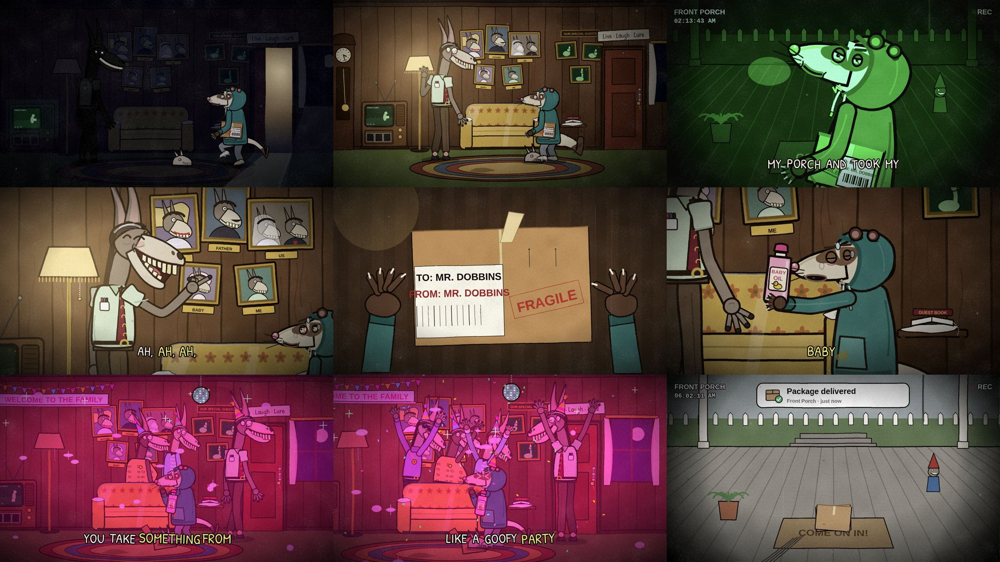

# Episode 006 — "Don't Steal HIS Package"



| | |
|---|---|
| **Audio** | Supplied by you (comedy skit audio, 1:07). No audio credit is written into the video or this repo on purpose — add it in each platform's description once you've confirmed the source. |
| **Length** | 1:10 (66.8 s audio + 3.3 s silent punchline on the porch cam) |
| **Status** | ✅ final — timeline from the real audio (whisper + Rhubarb); stills reviewed in both formats; MP4s not rendered here |
| **Compositions** | `ep006-his-package` (1920×1080) · `ep006-his-package-vertical` (1080×1920) |
| **Code** | `video/src/episodes/006-his-package/` — `livingroom.tsx` (set, lighting, cameras), `cutaways.tsx`, `shots.tsx`, `cast/`, `timeline.json` |

**Cast (new, in `video/src/episodes/006-his-package/cast/`):**
- **Skeeter** (`Ferret.tsx`) — twitchy ferret porch pirate. A long cream-and-sable noodle in a stained teal hoodie (hood up,
  round ears poking through DIY holes), saggy grey sweatpants, trashed sneakers, a soft bandit mask over red-rimmed beady
  eyes, a nose that never stops twitching and a tail that bottle-brushes when he's scared. Holds/hides/opens the package,
  holds out or hugs the baby oil, tiptoe-sneak walk cycle, hops, cowers, trembles, sweats, party hat, glitter.
- **Mr. Dobbins** (`Mule.tsx`) — gangly mule homeowner, creepy-polite. Very long ears, a gelled slicked-back mane with a kiss
  curl, wide unblinking pin-prick eyes, and a grin that runs almost to his ears, full of huge flat buck teeth on a hinged jaw.
  Mint short-sleeve shirt with a pocket protector, a maroon horseshoe-print tie tucked into hiked-up brown slacks, argyle
  socks over hooves. Finger wag, pointing, clapping, looming lean/neck crane, walk cycle, dance groove, party hat, and a
  "sunk into the dark" mode where only his eyes and teeth catch the light.
- **The cousins** (same rig, `outfit` variants) — Earl (big, leopard tank, gold chain), Lyle (tall, lavender turtleneck,
  medallion, sunglasses) and Dot (ruffled tux shirt, bow tie). Same grin, same mane. They don't speak.

**Set:** Mr. Dobbins' living room at 2:13 AM — 70s wood panelling, a mustard floral sofa under a clear plastic slipcover, a
wall of family portraits that are all him (MOTHER in a wig and pearls, FATHER with a moustache, BABY, the wedding photo "US"
where he marries himself, ME), an "OUR SPECIAL GUESTS" wall of doorbell-cam stills of previous porch pirates (a pigeon, a rat,
a goose — all in party hats), a GUEST BOOK, a LIVE · LAUGH · LURE sign over the door, three chain locks hanging open, a
grandfather clock stopped at 3:33, a squeaky toy shaped like his own head, and the porch cam looping the theft on a wood
console TV. Lighting by the clock: moonlit dark → lamp on → (two claps) hot pink with a disco ball, bunting and a WELCOME TO
THE FAMILY banner. Cutaways: the doorbell-cam footage of the theft (night vision, fisheye UI), the unboxing close-up (the
label reads TO: MR. DOBBINS / FROM: MR. DOBBINS — it was bait), and the porch cam the next morning.

**Silent beats + gags:** the sneak-in (0–5.3 s: door swings open on him, he freezes at each floor creak, steps on the squeaky
toy, and a grin has been hanging in the dark corner the whole time — the lamp clicks on and Dobbins is right there); hiding
the box behind his back and whistling (11.6–13 s); the unboxing (34.5–40 s: label gag, Dobbins' head tilting further and
further, a golden mystery-box glow and packing peanuts on the box-pop sound); the eyebrow wiggle/wink as the party music
starts (41.8 s); two claps on the two hits at 43.7/43.9 s flip the room pink; heads rising one by one from behind the sofa;
the party hat and blowout horn; jazz hands on "goofy party"; everyone laughing on the laugh track. **Punchline (tail):** next
morning on the porch cam — Skeeter, glittered and still in his party hat, bolts for the steps; a long mule arm in a mint
sleeve grabs his ankle and yanks him back inside; slam; the new bait box sits on the COME ON IN! mat; phone notification:
*"Package delivered."*

## Speakers

Assigned from meaning first, then checked against the reference video (contact sheets at 1 fps, then 2–6 fps around every
ambiguous line) and a per-line audio comparison (median pYIN pitch per word, plus mean MFCCs 1–19 on voiced frames →
nearest centroid; leave-one-out on the sure lines 11/13). The two voices separate cleanly on pitch: the thief talks at
~90–110 Hz and only jumps to ~220–230 Hz when startled; the homeowner's goofy voice lives at ~210–500 Hz with deep dips
(~70 Hz on a dramatic "Who am I?").

| Line | Speaker | Why |
|---|---|---|
| "Who are you?" | Skeeter | On camera in the reference, gesturing, mouth moving; "Who am I?" is the echo. 216 Hz = his startled register. |
| "Who am I? I'm the guy you stole that package from." | Dobbins | Meaning; on camera. |
| "What are you talking about?" | Skeeter | ~100 Hz, nearest-centroid thief. |
| "Caught you on my doorbell camera … That's not very nice." | Dobbins | Meaning; 210–320 Hz. |
| "Okay, look, I can explain. I didn't mean—" | Skeeter | ~95–105 Hz; cut off by… |
| "Ah, ah, ah, ah! Too late for all that now! Why don't you go ahead and open it…" | Dobbins | Meaning; 270–360 Hz. |
| "Baby oil." | Skeeter | **Close call.** Thief on camera reading the bottle; ~96 Hz, nearest neighbours are all thief lines. |
| "Oh dear." | Skeeter | **Close call.** 226 Hz could be either voice, but "Oh" starts at 121 Hz and rises like his startled "Who are you?", the timbre neighbours are mostly thief lines, and in the reference his lips form "oh … dear" on camera (42.4–43.6 s) before the cut to the homeowner. |
| "You're gonna learn today?" | Dobbins | **Close call** (whisper's "?" suggests a question). Sweeps 74 → 310 Hz like his other lines, timbre groups with his, and he's on camera talking in the pink light. |
| "Hey look, I'm sorry, you can actually take it back." | Skeeter | Meaning (offering the package back). |
| "Oh no, keep it! You're gonna need it for what happens next!" | Dobbins | Meaning. |
| "you take something from me, well I'm gonna take something from you, ain't no party like a goofy party" | Dobbins | Off-screen in the reference (camera stays on the thief while the buddies gather). Single coherent voice in his falsetto range (230–500 Hz) over the music, so only Dobbins lip-syncs; the cousins dance and laugh but never mouth words. |

Edit `speakers.json` and re-run `python3 pipeline/build_timeline.py episodes/006-his-package` if you hear it differently.

## Notes

- Engine untouched: the night-vision footage and the pink party use the per-shot `filter` (plus an in-world multiply/screen
  light layer in `livingroom.tsx`); the porch-cam UI and phone notification are drawn in screen space in `cutaways.tsx`.
- Skeeter's hoodie is teal, not the beige the brief suggested: the reference thief wears a cream/beige hoodie, and the house
  rules say not to copy reference outfits or colours.
- The reference's "lights flip pink at ~45 s" is synced to the two sharp hits in the audio at 43.71/43.92 s (Dobbins claps).

## Render (both versions)
```bash
pipeline/fetch_audio.sh <the-audio-file> episodes/006-his-package   # -> video/public/episodes/006-his-package/audio.wav
cd video && npm run render -- 006-his-package
```

## Upload kit
**Title:** Don't Steal HIS Package (Animated) · alt: *Ain't No Party Like A Goofy Party*
**Description:** Skeeter swiped a package off a porch and came back for more. Mr. Dobbins has been waiting in the dark. He'd
like you to open it.
*(add the audio credit here)*
**Tags:** porch pirate, package thief, doorbell camera, animated skit, cursed animation, creepy cartoon, dark humor animation, mule, ferret, baby oil
