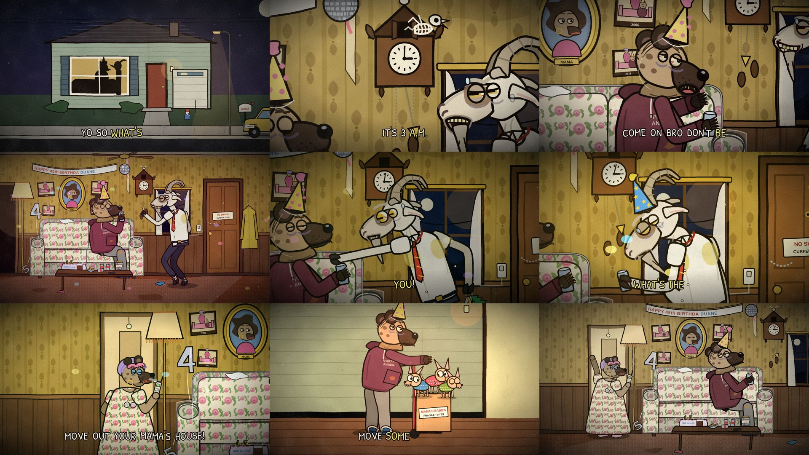

# Episode 007 — "What's the Move?"



| | |
|---|---|
| **Audio** | Supplied by you (comedy skit audio, 1:01). No audio credit is written into the video or this repo on purpose — add it in each platform's description once you've confirmed the source. |
| **Length** | 1:05 (61.2 s audio + 3.6 s silent punchline) |
| **Status** | ✅ final — timeline from the real audio (whisper + Rhubarb), speakers checked by meaning + timbre/pitch analysis |
| **Compositions** | `ep007-whats-the-move` (1920×1080) · `ep007-whats-the-move-vertical` (1080×1920) |
| **Code** | `video/src/episodes/007-whats-the-move/` — `livingroom.tsx` (set, cameras, scene), `cutaways.tsx`, `shots.tsx`, `cast/` (Hyena, Goat, Mama + chihuahuas), `timeline.json` |

**Cast (new, in `video/src/episodes/007-whats-the-move/cast/`):**
- **Duane** (`Hyena.tsx`) — balding, paunchy spotted hyena, 45 today: three-strand comb-over, bloodshot droopy eyes, a faded
  maroon PARTY ANIMAL hoodie stretched over the gut, sweatpants, socks with slides, a can of FLAT LITE and a sad birthday hat
  on an elastic. Keeps asking what's the move. Rig: sit/stand, 11 expressions, sip, party blower (with a limp mode), hat droop,
  slump, strain + sweatband + 2 LB dumbbell for the gym gag.
- **Lyle** (`Goat.tsx`) — lanky dirty-white goat with a mangy eye patch, gold sideways-slit pupils, ridged horns and a permanent
  buck-toothed grin; sweat-soaked short-sleeve shirt, loosened tomato tie, slacks too short, hooves for hands, a key ring with a
  dead pine-tree air freshener. Laughs "ah-hyuk". Rig: IK legs (dance, tiptoe, moonwalk), lean/sway/crouch, head-thrown-back
  laugh, the "Duane impression" slump (spare party hat + can), pit reveal (stink lines, drips, flies), key twirl.
- **Mama** (`Mama.tsx`) — squat old hyena in a muumuu cut from the same floral fabric as the couch, ears poking through a lilac
  satin bonnet, sleep mask on her forehead, coral lipstick, a mole with a hair, long-ash menthol, cordless phone. Never speaks.
  Plus her three trembling chihuahuas in sweaters.

**Set:** MAMA'S LIVING ROOM at 3 AM — mustard wallpaper over wood panelling, shag carpet with a plastic runner, the floral
couch in its plastic, Mama's glamour portrait (eyes follow you), "Duane on this couch" photos from 1983 to 2019, a
HAPPY 45th BIRTHDA DUANE banner (the Y fell off), a "4" balloon still floating and a "5" that gave up, a cuckoo clock whose
bird is a skeleton, a NO SHOES / CURFEW 11PM sign, the MOVE OUT FUND jar (three coins, a button, a moth), and a disco ball on
the ceiling fan that Lyle switches on when the beat drops (22.5 s; the dance follows the ~100 BPM music bed).
Cutaways: the house at night (silhouettes in the window), the 3 AM cuckoo, the soaked armpit, the family photo wall, Mama in
the hallway (glowing eyes first), the garage "gym" (NO PAIN NO GAIN – SINCE 1997), moving day for MAMA'S BABIES (FRAGILE · BITES).
Silent beats: Lyle's grin + the long reach for the switch (21–22.5 s), the limp party blower (32.1 s), the moth (35 s),
Mama's ash (41.5 s), the moonwalk out, the door slam and the exterior (55–59 s), the disco ball winding down.
**Punchline (tail):** Duane, alone, turns to the camera and silently mouths "…what's the move?" — two eyes glow in the dark
hallway, the light clicks on, and Mama jerks a thumb toward bed.

## Speakers

Assigned from the script's meaning, then checked with a per-line timbre comparison on the audio (mean MFCCs, 20 coeffs,
c0 dropped, voiced frames; leave-one-out on the sure lines 13/16) plus frame-level GMMs (couch vs goat, LOO 12/15 with a
calibrated threshold) and the pitch track (Duane ≈ 80–130 Hz, Lyle ≈ 135–500 Hz with a goofy high register).
Close calls:
- **"Like what? Tired? Exhausted? Sweaty?"** → Lyle. Strongly goat-like timbre and the same ~215 Hz register as his
  "I'm going home, buddy"; he's describing himself (the answer to "don't be like that").
- **Second "What's the move?" (2.95 s)** → Duane, repeating himself (timbre on his side; Lyle answers "It's 3 a.m.").
- **"Oh dear, you know what's not young? You!"** → Lyle. The deadpan setup sits low, in Duane's register, but "You!" is
  strongly goat-like and the roast is his.
- **"You old at 3 a.m. asking what's the move"** (whisper heard "Held at 3am…") → Lyle doing an *impression* of Duane: a
  high "You" at 36.0 s, then the pitch drops to ~100–120 Hz (Duane's register). Animated as an impression — he slumps, puts
  on a spare party hat and holds a can.
- **"Ooh," / "What's the move?" (49.7–51.3 s)** → "Ooh" is Lyle (the tail of his laughing fit, same ~335 Hz as the
  ah-hyuks); "What's the move?" is Duane, oblivious, at ~120 Hz — answered by "Move out of my way so I can go home and sleep!"

Cross-checked against the reference video at the four close spots (frames at up to 10 fps): the goat-equivalent is on
camera gesturing with open palms on "like what" (≈10 s); his extreme close-up has the mouth moving through "Oh dear… You!"
(24–26 s); he is on camera talking through the "you old at 3 a.m." impression (37–39 s); and on "what's the move?"
(50.4–51.3 s) he is on camera with his **mouth closed** while the line plays at ~120 Hz — so that one is the couch guy,
off-camera, as assigned. Edit `speakers.json` and rebuild (below) if you hear anything differently.

**Transcript fixes:** `analysis/transcript.json` is whisper's output, untouched. `analysis/transcript_fixed.json` is the one
the timeline uses: word boundaries re-timed against the loudness/pitch envelope (the 2nd "what's", "it's", "come",
"tired/exhausted/sweaty", "brother/the", "oh dear", "you'll"), "Held" → "You old", and the split tokens merged so the captions
read "AH-HYUK!" and "3 A.M.". Words changed by hand carry `"fixed": true`.

## Render (both versions)
```bash
pipeline/fetch_audio.sh <the-audio-file> episodes/007-whats-the-move     # -> video/public/episodes/007-whats-the-move/audio.wav
python3 pipeline/build_timeline.py episodes/007-whats-the-move --transcript analysis/transcript_fixed.json
cd video && npm run render -- 007-whats-the-move
```

## Upload kit
**Title:** What's the Move? (Animated) · alt: *It's 3 A.M., Duane*
**Description:** 3 AM at Mama's house. It's Duane's 45th birthday party, the only guest is leaving, and Duane still wants to
know what the move is. Lyle has some suggestions.
*(add the audio credit here)*
**Tags:** whats the move, 3am, animated skit, cursed animation, creepy cartoon, dark humor animation, roast, birthday, moonwalk
