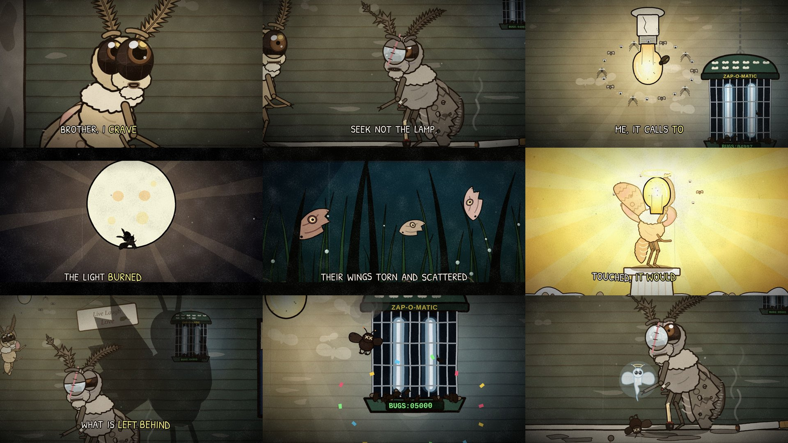

# Episode 008 — "Brother, I Crave the Forbidden Lamp"



| | |
|---|---|
| **Audio** | Supplied by you (comedy dialogue audio, 3:39). No audio credit is written into the video or this repo on purpose — add it in each platform's description once you've confirmed the source. |
| **Length** | 3:46 (219.2 s audio + 7 s silent punchline and title card) |
| **Status** | ✅ complete — timeline from the real audio (whisper + Rhubarb); stills reviewed in both formats. Full MP4s not rendered here. |
| **Compositions** | `ep008-forbidden-lamp` (1920×1080) · `ep008-forbidden-lamp-vertical` (1080×1920) |
| **Code** | `video/src/episodes/008-forbidden-lamp/`: `shots.tsx` (direction), `porch.tsx`, `lamp.tsx`, `sky.tsx`, `lawn.tsx`, `exterior.tsx`, `cutaways.tsx`, `common.tsx`, `cast/` |

The overwrought epic is played completely straight. The "forbidden lamp" is a bare 60-watt porch bulb at a shabby house,
with a bug zapper hanging next to it.

## Cast (new, in `cast/`)
- **Brother Wick** (`Moth.tsx`, `kind="wick"`): the craver. Young, twitchy and wide-eyed. He has sandy-cream fuzz, a fluffy
  collar, peach wings with dusty-rose smudges, huge glossy compound eyes that reflect the bulb, and feathery antennae
  that never stop twitching. His proboscis uncoils whenever he looks at the light.
- **Brother Tatter** (`kind="tatter"`): the elder. He is ashen grey with a bald patch and a cloudy, stitched-up eye. One antenna
  is bent, his forewing is torn and holed, and the wing edges are scorched. A middle leg ends in a bandaged stump, and a
  hind leg is a burnt matchstick that still smokes. His voice quavers and he sheds dust like dandruff.
- **Young Tatter** (`young`): the flashback version, unscarred and with fuller fuzz.
- **Props and extras** (`Husk.tsx`, `lamp.tsx`, `sky.tsx`): crispy moth husks with X eyes and embers, Wick's little ghost
  with a halo, the cartoon X-ray skeleton, dead moths on their backs, loose wings, ants, and the bulb's faithful (gnats,
  crane flies, a June bug head-butting the glass). Also a bat, a "THANK YOU" plastic bag, and a moon that slowly smirks.

The rig has compound eyes with night eyeshine, comb-feathered antennae (perk, droop, twitch and talk-bounce), standing,
flying and lying poses, wing spread and flap, insect legs, crouch, tremble, tears, a panting "spent" state, dust shedding
and lip-sync.

## Sets
- **The porch rail** (main set, moth scale): peeling siding, a ceramic socket with a pull chain, and a moon over the yard.
  The dressing includes a "Live Laugh Love" sign with a bug smear, a wasp nest, a web holding a silk-wrapped moth mummy,
  a smouldering lipstick cigarette butt, a bottle cap, a dead fly, a duct-taped screen door and moth-dust prints on the wall.
- **The lamp** (macro): the glowing bulb and its cult, and the **ZAP-O-MATIC**. The zapper has a tray of crispy bugs,
  moth kill marks painted on like a fighter plane's, and an LCD `BUGS:` counter.
- **The flashback sky** (custom `EPIC` grade, letterbox): the rooftop and its bent TV antenna, the power line and sleeping
  birds, then cloud banks, a passing plane and the stars. Above it all is the moon, drawn in screen space so it never
  gets any closer.
- **The lawn under the zapper**: a lattice crawlspace in cold blue light, dew drops, dead moths, torn wings impaled on
  grass blades like battle flags, ants sailing a wing away, his own severed leg (still twitching) and a cigarette butt
  the size of a log.
- **The house exterior** (human scale): a couch on the lawn, a headless flamingo, a kiddie pool of green water, a car on
  blocks, a BEWARE OF DOG sign with an empty collar, and two moth specks by the porch light.
- **Wick's apotheosis** ("it would not make you as it is"): Wick on a pedestal with a light bulb for a head, adored. The
  bulb cracks, shatters and leaves a smoking husk.

**Running gag:** the zapper counter is driven by the clock: 04996 → 04997 → 04998 → 04999 → **05000** (confetti) → 05001.

**Silent beats:**
- **5.4–10.9 s:** the lamp in its glory, Wick's eyes and uncoiling proboscis, a gnat goes in (ZAP, 04996) and Wick flinches.
- **211.6–219.2 s** (music): Wick's ascent toward the bulb, his swerve when the zapper's blue catches his eye, and Tatter's
  realisation.

**The tail (silent punchline):**
1. ZAP: the X-ray flicker and the counter hits 05000 with confetti.
2. The smoking husk drops onto the rail beside Tatter and its ghost floats up toward the light.
3. A second ZAP flashes offscreen (05001) and Tatter blinks.
4. Title card.

## Speakers
Assigned line by line from the script's meaning, then checked against a timbre model. One performer voices both
brothers, and a sustained music drone runs under the dialogue, so pitch tracking was useless: pyin found almost no
confidently voiced frames. The models therefore use only speech-dominant frames, those more than 6 dB above a rolling
estimate of the music bed. Three independent models were trained on the 38 lines that are certain by meaning:
- **Per-line shrinkage LDA** on mean MFCC c1–c19 plus voice quality (cepstral peak prominence, high-frequency ratio,
  local SNR). Leave-one-out: **36/38**.
- **Bed-subtracted long-term spectrum LDA.** Leave-one-out: **36/38**.
- **Frame-level logistic regression.** Leave-one-line-out: **32/38**.

Both misses in the 36/38 models are Wick's quietest, breathiest lines (22.8 s and 27.3 s). The models' one systematic
error is calling soft craver lines elder. In the spectrogram, Tatter's voice has a strong tremolo and is brighter;
Wick's is steadier and darker.

| Line | Speaker | Why |
|---|---|---|
| "I know this." (31.6 s) | Tatter | Leads into "I too once followed…"; P(craver) 0.01 on both LDAs |
| "Indeed. And yet you live." (42.8–45.2 s) | Wick | "Indeed" scores 1.00 craver on all three models; flows straight into his "You touch the forbidden lamp…" |
| "It would simply destroy you" (162.2–164.7 s) | Tatter | Finishes his own sentence. Spectrum 0.24 and frame model favour the elder; line LDA 0.86 dissents. The spectrogram shows his tremolo cry on "you", then a music-only gap before "even so" (~165.3 s) |
| "Even so, I can no longer…" through "…born of love" (164.7–180.4 s) | Wick | ≥ 0.98 craver on all models. Whisper's dangling "I" at 176.5 s opens "I forgive your fears" (the craver forgiving his brother's fears) |
| "If you love me, brother, then forsake this mad quest" (180.4 s) | Tatter | 0.00 craver on all models; the sliding window flips exactly at "if" |
| "I cannot." (184.0–185.6 s) | Wick | **Closest call.** The answer to "forsake this mad quest". "I" scores craver; the soft "cannot" leans elder on two models, which is the known bias, so meaning decides |
| "Remember me, brother." (186.5 s) | Wick | ≥ 0.80 craver on all models |
| "No!" (187.7 s, the long wail) | Tatter | 0.00 craver on all models |
| "No." (190.0 s) | Wick | 0.86–1.00 craver on all three models despite the bias. It plays as his hurt reply, which Tatter answers with "Fly, then!" |
| "Fly, then…" through "…never were" (191.4–211.6 s) | Tatter | Every sentence ≤ 0.10 craver, except the whispered fade "never were" (two models lean craver). It ends his sentence, so it stays his |

Edit `speakers.json` and re-run `python3 pipeline/build_timeline.py episodes/008-forbidden-lamp` if you hear it
differently. The shots are `cue()`-anchored and follow the words.

## Built inside the episode folder (no engine changes)
- `common.tsx` adds `ScreenSpace`, which draws in output pixels from inside a `<Stage>` and follows the 9:16 reframe.
  It is used for the moon that never gets closer, the POV eyelids and grass, and the speed lines. It also adds `Parallax`.
- `sky.tsx` adds the `EPIC` custom filter grade and the `Bars` letterbox for the flashback.
- There is no per-frame turbulence or blur. Stills take about 1.5–3 s in this shared container, comparable to 004 under
  the same load.

## Render (both versions)
```bash
pipeline/fetch_audio.sh <the-audio-file> episodes/008-forbidden-lamp   # -> video/public/episodes/008-forbidden-lamp/audio.wav
cd video && npm run render -- 008-forbidden-lamp
```

## Upload kit
**Title:** Brother, I Crave the Forbidden Lamp (Animated) · alt: *The Forbidden Lamp*

**Description:** Two moth brothers. One bare porch bulb. One bug zapper with a kill counter. Brother Wick craves the
forbidden lamp. Brother Tatter flew for the light once and came back with a match for a leg.
*(add the audio credit here)*

**Tags:** brother i crave the forbidden lamp, forbidden lamp, moth, moth meme, moth and lamp, bug zapper, animated meme,
cursed animation, creepy cartoon, dark humor animation
