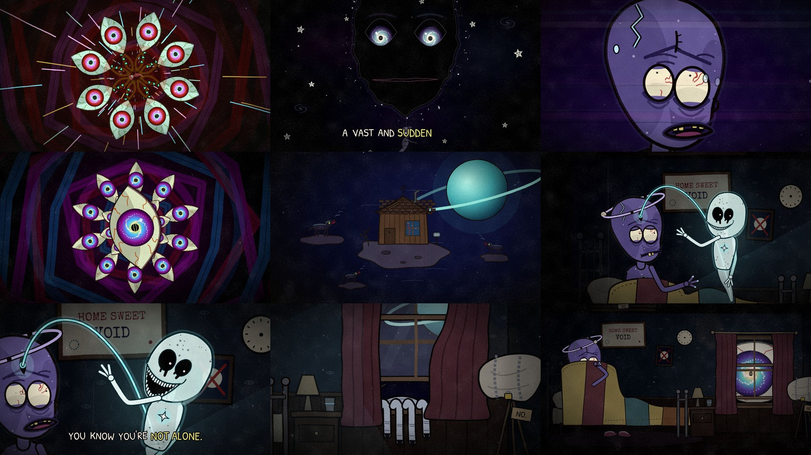

# Episode 009 — "I Once Saw the Face of God"



| | |
|---|---|
| **Audio** | Supplied by you (a narrated piece, then a two-voice night-time dialogue, over an ambient drone; 1:42). No audio credit is written into the video or this repo on purpose: add it in each platform's description once you've confirmed the source. |
| **Length** | 1:47 (102.1 s audio + 4.7 s silent ending: the eye at the window, then a title card) |
| **Status** | ✅ ready to render. Timeline from the real audio (whisper + Rhubarb + a bed-subtracted voice envelope); stills reviewed in both formats. MP4s not rendered here. |
| **Compositions** | `ep009-face-of-god` (1920×1080) · `ep009-face-of-god-vertical` (1080×1920) |
| **Code** | `video/src/episodes/009-face-of-god/`: `cosmos.tsx` (the noisy heavens), `psyche.tsx` (the trip set pieces), `room.tsx` (the shack and its room), `cast/` (Glim, Rachel, FaceOfGod, SpaceDog), `speech.ts` (mouths), `bits.tsx`, `shots.tsx`, `timeline.json`, `voice_env.json` |

## Cast (new, in `video/src/episodes/009-face-of-god/cast/`)

- **Glim** (`Glim.tsx`) is a humanoid astral being. He has dusty-violet skin full of star freckles and a huge lumpy lightbulb skull with a glowing crack in the dome. His bloodshot pinprick eyes sit in purple bags, and two crooked buck teeth never quite go away. A chipped ring with a pebble moon orbits his crown. A hole through his chest has a tiny galaxy turning in it, and a comet tail of stardust replaces his legs. At night he sits up in an iron bed under a patchwork blanket.
  - **Rig:** 10 expressions (neutral, awe, terror, dread, whisper, sleep, relieved, suspicious, wince, hush), blinks and eye darts (he stops blinking when terrified), lip-sync, head tilt and bob, tremble and sweat. Poses: float or bed, recline, gripping hands. The blanket goes from lap to chin to peeking over the edge to a trembling lump, with the ring still orbiting it. He also has a third eye that opens.
- **Rachel** (`Rachel.tsx`) is Glim's inner consciousness; he calls her Rachel. She is an inside-out double of him: pale, translucent and lit from inside, freckled with black anti-stars, with a bright star plugged into the place where his chest hole is. She has void sockets that drip black, each with one pinprick pupil, and a much-too-wide clenched grin that unclenches like a slot when she talks. She unspools from his third eye on a glowing cord and never leaves its reach.
  - **Rig:** 5 expressions (grin, sly, coo, blank, hungry), an owl head-twist, emerge and fade, lean, arm poses (reach, clasp, a "cuckoo" twirl by her temple) and lip-sync.
- **The Face of God** (`FaceOfGod.tsx`) is a face-shaped silence: a hole in the heavens with no stars in it, its ragged edge crowded by stars. Its eyes are two slowly turning spiral galaxies with black-hole pupils, and its mouth is a long nebula rift lined with tiny stars for teeth. `GalaxyEye` is reused for the kaleidoscopes and the eye at the window.
- **The dogs** (`SpaceDog.tsx`) are rib-thin strays on drifting rocks, howling at nothing.

## Sets

- **The noisy heavens** (`cosmos.tsx`): nebulae, turning galaxies and two parallax starfields. Little stars with faces chatter non-stop, with rings of noise pulsing off them, over radio-static colour bands. When the face appears everything stops: the stars fall silent and turn to stare, the colour drains and the static cuts out.
- **The trip** (`psyche.tsx`) covers the 0–6 s intro and the 31.6–44.4 s musical gap. It uses star tunnels, pulsing rings and rotating polygon mandalas, plus kaleidoscopes (`<use>` copies) of three things: veiny galaxy eyes on toothed stalks, Glim's own screaming heads, and long three-fingered hands reaching in. A vortex of teeth and eyes swirls around the face of God's rift. The hue cycles every frame, but the palettes stay dark.
- **The shack and its room** (`room.tsx`): a one-room shack on a rock among the stars, under a ringed planet, with the dogs on the rocks around it.
  - **Inside:** an iron bed, an open sash window onto space with curtains that won't stay still, a telescope under a sheet in chains (tag: "NO."), a skylight boarded shut ("NO"), a clock with no hands, a framed moon crossed out, wallpaper with little moons and little eyes, a "HOME SWEET VOID" sampler, and pink slippers he can't wear.
  - **The window carries the dread:** a pale face slides past, the glass fogs, fingers hook over the sill, breath clouds the glass and a smiley is drawn in it from outside, and finally the eye arrives.

## Story beats (`shots.tsx`, every shot `cue()`-anchored)

| Time | What happens |
|---|---|
| 0–6 s | A pinprick in the void grows into a tunnel of eyes that spits him out. |
| *"I once saw the face of God,"* | He drifts, then looks up. |
| The pause, 8.9–10.7 s | The silence takes a face. |
| *"a vast and sudden silence"* | The stars stop and stare and the colour drains. |
| *"among the noisy heavens."* | The noise floods back; then his terrified stare. |
| *"That evening I dreamed I listened to one side of a conversation…"* | He sleeps under a strip of nebula with an old telephone receiver at his head. Its coiled cord runs all the way up to the face's mouth. |
| *"…I should not have overheard."* | He jolts awake. |
| *"I do not watch the skies anymore."* | The chained telescope. |
| *"I do not look up."* | He won't, so the camera does: it tilts up to the boarded skylight. |
| The gap, 31.6–44.4 s | The trip, cut to the swells in the music. A slam to the shack lands on the low boom at 44.4 s. |
| *"Some nights are darker… almost black, Rachel."* | His third eye opens on "Rachel" and she unspools from it. |
| *"Scared of being alone."* / *"You know you're not alone."* | Her line. |
| *"What? What was that?"* | Something pale slides past the window. |
| *"It's just the dogs."* | The dogs howl. |
| *"No. I mean at the window."* / *"At the window?"* | Her head twists all the way round to look. |
| Silence | Long fingers hook over the sill. |
| *"The wind's blowing, that's all. I'll lower it a little."* | She floats over on her cord and lowers the sash. |
| *"Oh, I thought I heard something."* | She does the cuckoo twirl by her temple. |
| Whispers | Breath fogs the glass and a smiley is drawn in it from outside. |
| *"It's just the wind."* | She grins hungrily and goes back inside his head. He falls asleep. |
| Silent tail | The eye slides into the window. He wakes, peeks over the blanket, it blinks, and he goes all the way under. His little moon keeps orbiting the lump. Title card. |

In 9:16 every shot has its own reframe. Wides follow the action, and the ending whip-pans from Glim to the eye (for the blink) and back to Glim (for the duck).

## Speakers

**Three recorded voices.** Numbers come from `analysis/voice_analysis.py`, which removes the music bed before measuring.

1. **Narrator** (5.7–30.7 s). One voice throughout: a dry, close-mic'd recording with no room sound. His lines cluster tightly by timbre: the mean MFCC distance between narration lines is 0.28, against 1.21 to the dialogue lines and 0.99 among the dialogue lines themselves.
2. **Dialogue voice A** is breathy and often half-whispered. Its spectral tilt is positive (2–5 kHz vs 0.3–1 kHz: +1…+2 dB on "Some nights…", "Some nights are darker", "Like tonight", "What?") and its voicing fraction is low. When voiced, f0 is about 205–250 Hz, in a reverberant room. This is the frightened voice; it opens the dialogue and says "Rachel".
3. **Dialogue voice B** is calm and fully voiced (tilt −3…−9.5 dB), f0 about 175–235 Hz, in the same room. This is the reassuring voice.

**Assignment.** The narration and voice A go to **Glim**. The narrator is the "I" who saw the face and won't look up. Voice A is the frightened one who opens the dialogue and carries most of it. Voice B goes to **Rachel**, his inner consciousness.

The original was probably two people, with A talking to someone called Rachel. So Glim gives the voice in his head that name: she appears from his third eye the moment he says "Rachel". Acoustically the narrator is a third voice; dramatically it is Glim's voice-over.

**Evidence.** dA and dB are the mean MFCC cosine distances to the sure A lines and the sure B lines.

| t (s) | line | tilt dB | f0 | dA | dB | by meaning | → |
|---|---|---|---|---|---|---|---|
| 50.3 | Some nights… | +2.1 | 248 | 0.72 | 1.10 | A | Glim |
| 53.1 | Some nights are darker. | +1.0 | 224 | 0.64 | 1.15 | A | Glim |
| 56.0 | Some are almost black, Rachel. | −4.4 | 204 | 0.70 | 1.17 | A | Glim |
| 60.2 | Like tonight, it seems so dark. | +1.0 | 241 | 0.72 | 1.01 | A | Glim |
| 64.6 | Scared of being alone. | −2.6 | 220 | **0.56** | 1.10 | ? | Glim |
| 67.0 | You know you're not alone. | −5.0 | 174 | 1.18 | 1.18 | B | Rachel |
| 69.9 | No. | −6.4 | 276 | **0.98** | 1.16 | ? | Glim |
| 71.6 | What? | +2.9 | 240 | **0.93** | 1.09 | ? | Glim |
| 74.0 | What was that? | −9.8 | 224 | 0.90 | 1.12 | A | Glim |
| 76.9 | It's just the dogs. | −9.1 | 287 | 1.03 | 1.05 | B | Rachel |
| 79.0 | No. | +5.3 | 272 | 1.25 | **0.90** | ? | Glim |
| 80.2 | I mean at the window. | −1.6 | 258 | 0.82 | 1.12 | A | Glim |
| 81.9 | At the window? | −13.0 | 251 | 1.10 | **0.93** | ? | Rachel |
| 85.2 | The wind's blowing, that's all. I'll lower it a little. | −9.5 | 205 | 1.29 | 0.98 | B | Rachel |
| 89.6 | Oh, I thought I heard something. | −4.4 | 215 | 0.85 | 1.01 | A | Glim |
| 96.3 | It's just the wind. | −3.0 | 185 | 0.89 | 1.00 | B | Rachel |

The leave-one-out nearest-centroid test on the 11 unambiguous lines gets 9/11 right. The two misses are B's short "It's just the dogs." and "It's just the wind.", which stay on Rachel by meaning.

**Close calls**

- *"Scared of being alone."* could be either speaker. The timbre is clearly A and it continues his confession, so Glim.
- *"No."* (69.9 s) and *"What?"* (71.6 s): timbre A, and the meaning fits (he denies being alone, then hears something), so Glim.
- *"No."* (79.0 s): the timbre leans B, but it's the first word of "No. I mean at the window." A single word under the drone is weak evidence, so the meaning wins: Glim.
- *"At the window?"*: the timbre leans B and it's the echo-question that leads into "The wind's blowing…", so Rachel.
- **Pitch** isn't used for the narration. The drone's partials sit in the voice range, so the methods disagree (about 130 Hz versus about 270–290 Hz).

To change the assignment, edit `speakers.json` and rerun `python3 pipeline/build_timeline.py episodes/009-face-of-god`.

## Audio bed (what plays in the gaps)

- A sustained ambient drone runs under everything. It is tonal (spectral flatness about 0.01) and wide stereo: the side channel is as loud as the mid, while the voices sit in the centre. It fades in over 0–4 s and out over 99–101.5 s.
- The 30.7–50.3 s gap is music only. On the music-only side channel there are flux peaks (swells) at 33.4, 36.4, 38.2 and 39.7 s. The low end thins out from about 37 to 44 s, and the high band fades into a near-silent dip around 43.3–44.2 s. The strongest low boom comes at 44.4 s, then the bass returns. The trip is cut to these events.
- There are **no dog, wind or window sound effects**; those exist only in the words, so they are staged visually.
- Rhubarb picks up untranscribed breathy sounds at about 94.9–96.2 s and 97.9–101.1 s, whispers or breaths under the fade-out. They drive the breath patches on the glass.

## Engine notes (all inside this episode's folder; the engine is untouched)

- **Mouths** (`speech.ts` + `voice_env.json`): the drone is so loud that Rhubarb's cues here are mostly long static "B" stretches. Each speaker's mouth is therefore gated by a voice-only envelope (music bed subtracted; written by `analysis/voice_analysis.py`). Rhubarb's short cues are used where they carry information, and a viseme read from the word's spelling fills the rest.
- **Per-frame grade** (`bits.tsx` → `Tint`): `ShotDef.filter` is one fixed string per shot. Hue cycling that follows `shot.t` therefore happens inside the shot, and those shots set `filter: "none"`.
- **Performance:** no turbulence, blurs or blend modes. Stills measured 1.2–2.6 s each under heavy shared load (4 CPUs, 6 agents), the same as an episode-004 frame measured alongside.

## Render (both versions)

```bash
pipeline/fetch_audio.sh <the-audio-file> episodes/009-face-of-god     # -> video/public/episodes/009-face-of-god/audio.wav
python3 episodes/009-face-of-god/analysis/voice_analysis.py            # only if the audio changes (rewrites voice_env.json)
python3 pipeline/build_timeline.py episodes/009-face-of-god            # only if speakers.json changes
cd video && npm run render -- 009-face-of-god
```

## Upload kit

**Title:** I Once Saw the Face of God (Animated Cosmic Horror) · alt: *It's Just the Wind*

**Description:** He saw the face of God once. Now he doesn't look up, and the voice in his head says it's just the wind.
*(add the audio credit here)*

**Tags:** face of god, cosmic horror, creepy animation, psychedelic animation, trippy cartoon, space horror, animated horror short, inner voice, dark humor animation, something at the window
