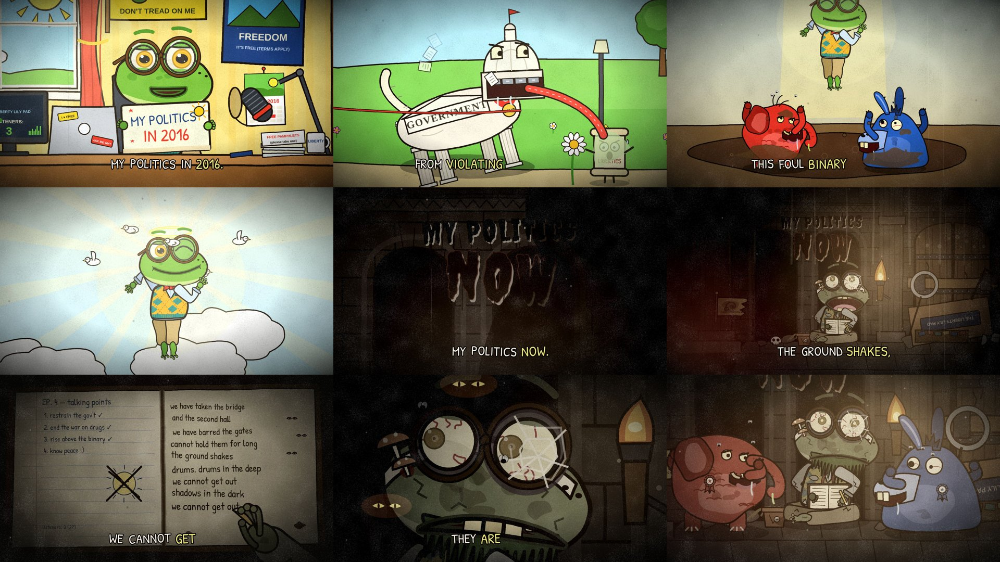

# Episode 010 — "My Politics: Then vs Now"



| | |
|---|---|
| **Audio** | Supplied by you (comedy audio, 1:01). No audio credit is written into the video or this repo on purpose — add it in each platform's description once you've confirmed the source. |
| **Length** | 1:03 (60.7 s audio + 2.6 s silent punchline) |
| **Status** | ✅ built, both formats reviewed (36 shots) — timeline from the real audio (whisper + Rhubarb) plus measured extras for the "Now" half (see *Lip-sync*) |
| **Compositions** | `ep010-politics` (1920×1080) · `ep010-politics-vertical` (1080×1920) |
| **Code** | `video/src/episodes/010-politics/` — `studio.tsx` (2016 podcast set), `cutaways.tsx` (2016 gags), `hall.tsx` (the underground hall, journal, the deep, the tail), `cast/Frog.tsx`, `cast/Mascots.tsx`, `shots.tsx`, `tl.ts` (timeline + extras), `timeline.json`, `audio_fx.json` |

**Cast (new, in `video/src/episodes/010-politics/cast/`):**
- **Wendell** (`Frog.tsx`) — an earnest bespectacled frog. *Then:* bright green, round tortoiseshell glasses over bulging
  gold eyes, braces, an oxford shirt, a mustard-and-teal argyle sweater vest, a red bow tie, khakis, webbed bare feet, a
  pocket constitution in his vest pocket and a vocal sac that swells when he gets going. *Now:* the same frog after
  months underground — grey-olive cracked skin and grime, hollow bloodshot eyes with pinprick pupils, one lens
  spider-webbed, a matted moss beard, mushrooms sprouting from his scalp, a bloodied bandage, the vest in rags, the bow
  tie hanging undone. Rig: 14 expressions, blinks, paranoid eye darts (now), tremble, IK arms, poses (stand / sit at the
  desk / cross-legged on the floor / float), props (the title sign, LIBERTY mug, pocket constitution, journal + pencil,
  leash), halo, glints, sweat and tears.
- **The foul binary system** (`Mascots.tsx`) — two invented, equally grotesque party mascots: the **Tusker** (a bloated
  red, wrinkled, elephant-ish blob with a snotty trunk and broken tusks) and the **Brayer** (a saggy blue, donkey-ish
  blob with floppy ears, mismatched bulging eyes and enormous buck teeth). Mud, drool, flies, campaign rosettes.
- Cutaway bit players (in `cutaways.tsx`): the **government** (a slobbering marble beast with a domed head, column legs,
  filing-cabinet teeth, a red-tape tongue and a GOVERNMENT frieze on its flank), **our liberties** (a tiny trembling
  scroll), a tank and a surrendering **pill**, a giant combat boot, doves.

**Sets:**
- *Then:* **THE LIBERTY LILY PAD**, a sunny bedroom podcast studio, June 2016 — a smiling sun in the window, bunting, a
  yellow DON'T TREAD ON ME flag with a coiled tadpole, a FREEDOM poster ("it's free, terms apply"), a JUNE 2016 calendar,
  an ON AIR light, a bookshelf with a generic powdered-wig bust, a boom mic, a LIVE monitor whose listener count drops
  3 → 2 → 1 as he talks, a LIBERTY mug, free pamphlets ("please take one") and a potted fern. Cutaways: the government on
  a leash in the park, the war on drugs (a tank vs one tiny pill → BANG flag), foreign military involvement (a boot
  stomping a globe), the foul binary system (the mascots brawling in a mud pit, grabbing at his feet as he ascends) and
  heaven (doves, rays; a dove lands on his head, he winks).
- *Now:* a vast torch-lit underground hall — MY POLITICS / NOW gouged into the wall, a chasm breathing red light with a
  broken bridge (his tadpole flag planted on it, torn), the barred gates barricaded with the 2016 studio (the desk with
  the LIBERTY LILY PAD banner upside down, ring light, snapped boom mic, books, the bust face-down, the chipped LIBERTY
  mug), the 2016 fern beside him, very dead, and a skull. Inserts: his journal (it's the old podcast notebook — neat
  2016 talking points and a smiley sun on the left page, now scratched out; the scrawl on the right), an eye in the
  crack of the gate, the deep (horned silhouettes beating a great drum round a fire), and a reverse into the dark.
- The score drives the hall: every drum hit shakes the camera, flares the torch, knocks dust off the ceiling and jolts
  the gate (one more crack per hit); more eyes open in the dark with each beat once the drums settle in; shadow
  claws creep in from "the shadows in the dark"; the torch gutters out after "they are coming".
- Silent beats: the listener counter (6 s), the smug sip (10.6 s), the dove + wink (19.9–21.3 s), the stare and the
  reveal of the hall while the drone rises (23.1–26.9 s), the bridge (28.5 s), dust from the ceiling (30.8 s), the eye in
  the gate (36.8 s), the first drum in the deep (40.1 s), the eyes opening (48.3 s), the gate splitting red (52.7 s), the
  slow turn to the dark (55.9 s), the torch dying (59.7 s).
- **Silent punchline (tail):** in the dark only the glowing eyes remain — then the torch flares one last time and the
  shadows step into the light: it's the Tusker and the Brayer, grinning, rosettes on, flanking him. The foul binary
  system found him. Blackout.

## Speakers

**One speaker** (a single turn in `speakers.json`), as briefed. Checked against the audio anyway:
- **Title read-outs:** "My politics in 2016." (0–2.8 s) and "My politics now." (21.3–23.1 s) are dry, mono inserts, each
  followed by digital silence (2.8–3.1 s and 23.1–23.5 s) — edited-in title cards. Same voice as the rest (yin median
  pitch ~165–170 Hz vs ~150–190 Hz for the lines), so they stay on Wendell; in the video he holds up the 2016 title card
  himself, and the "now" title is carved into the wall of the hall.
- **"Then" lines (3.5–19.9 s):** over a light, tonal stereo music bed (sustained chords in the side channel, 3.1–20.6 s;
  the gaps between lines sit at −20 to −24 dB, not silence).
- **"Now" lines (26.4–59.7 s):** over a dark score — a low mono drone from 23.5 s, stereo swells from ~31.5 s, and slow
  **drum booms** (centred low-band hits, many in gaps where nobody speaks): ~1.5 s apart from 40.1 s, ~1 s apart from
  46.4 s to 53.3 s, fading out to 59 s. The delivery is a little lower and graver (~135–157 Hz).
- **No second voice and no separate sound effects** besides the music beds; nothing needed re-assigning.
- **Transcript fix:** whisper heard "…this foul binary system *in no* peace"; it's "*and know* peace" — corrected for the
  captions in `tl.ts` (the analysis files are untouched).

## Lip-sync (custom, inside the episode folder)

Rhubarb found ~6–7 mouth cues/s in the "Then" half but only ~2/s under the loud "Now" score (one shape held for whole
words), and whisper stretched five words back over the pauses before them ("We" 26.4→27.0 s, "and" 28.4→29.6 s,
"out." 47.4→47.8 s, "The" 48.2→50.4 s, "we" 54.0→54.6 s, "they" 57.3→59.0 s). A re-run of Rhubarb on a cleaned excerpt
didn't help much, so `analysis/audio_fx.py` measures the voice directly — the voice is centred and the score is wide,
so |mid| − 1.3·|side| in 500–3400 Hz is a clean voice envelope — and writes `video/src/episodes/010-politics/audio_fx.json`:
mouth cues for the "Now" half (~10/s, shapes from loudness + spelling), the corrected word starts, the score's
low-band rumble envelope and the drum-hit times. `tl.ts` merges this into the generated timeline at load time; the
committed `transcript.json`, `mouth_cues.json` and the generated `timeline.json` are not edited. Engine untouched
(grades are per-shot `filter` strings: sunny for 2016, drained for the title, dark sepia for now).

To regenerate after re-transcribing: `python3 pipeline/build_timeline.py episodes/010-politics` then
`python3 episodes/010-politics/analysis/audio_fx.py`.

## Render (both versions)
```bash
pipeline/fetch_audio.sh <the-audio-file> episodes/010-politics   # -> video/public/episodes/010-politics/audio.wav
cd video && npm run render -- 010-politics
```

## Upload kit
**Title:** My Politics: Then vs Now (Animated) · alt: *What Happened to the Classical Liberal*
**Description:** 2016: an earnest frog with a podcast, a pocket constitution and three listeners. Now: the frog, a
journal, one torch, and the drums. *(add the audio credit here)*
**Tags:** my politics then vs now, then vs now, politics meme, animated meme, cursed animation, creepy cartoon, dark humor
animation, drums in the deep, frog, podcast
